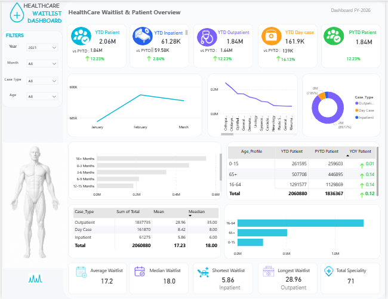

# Healthcare Waitlist Analysis Dashboard

## Dashboard Preview

## Project Overview

This project analyzes healthcare waiting list data using Power BI to identify trends in patient backlog, specialty performance, and patient demographics.

## Business Problem

Healthcare organizations need visibility into waiting list trends to improve resource allocation and reduce patient delays.

## Tools Used

- Power BI
- Power Query
- DAX
- Microsoft Excel

## Key Insights

- Total waiting list reached approximately 2.06 million patients.
- Orthopedics recorded the highest patient backlog.
- Outpatient services accounted for the majority of waiting list cases.
- Patients aged 16–64 represented the largest patient group.
- Average wait time was 17.2 months.
- Median wait time was 18 months.

## Dashboard Features

- KPI Summary
- Waiting List Trend Analysis
- Case Type Breakdown
- Age Profile Analysis
- Wait Time Distribution

## Recommendations

1. Prioritize resources for specialties with the highest backlog.
2. Improve outpatient scheduling efficiency.
3. Monitor age-specific healthcare demand trends.
4. Track waiting list growth through regular reporting.

## Files Included

- Health_data_set_PBI.pbix
- Dashboard Screenshot
- Project Documentation

## Author

**Favour Oladapo**
